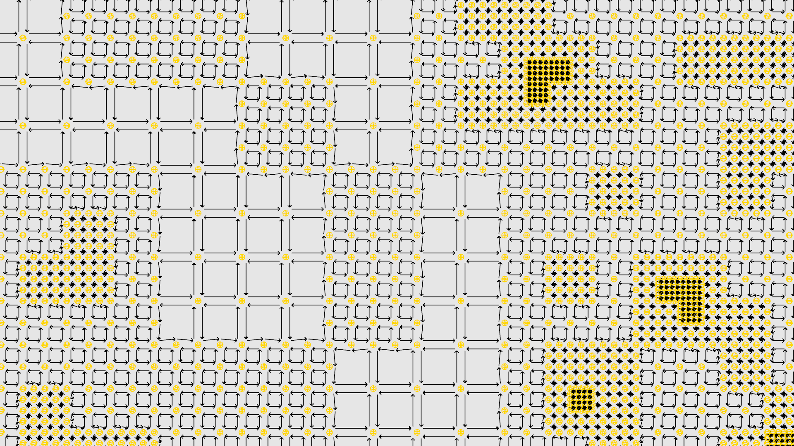
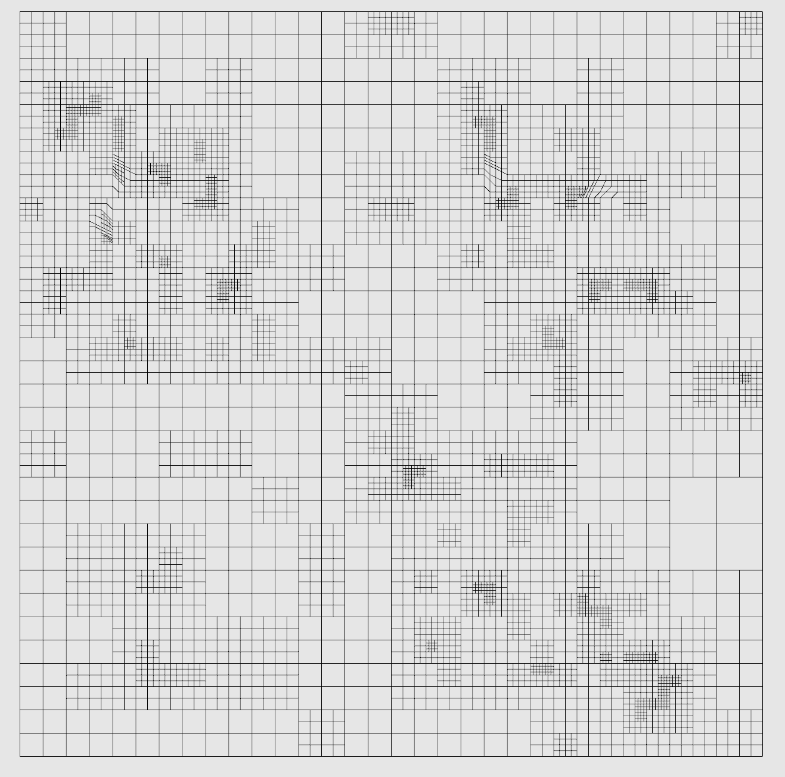
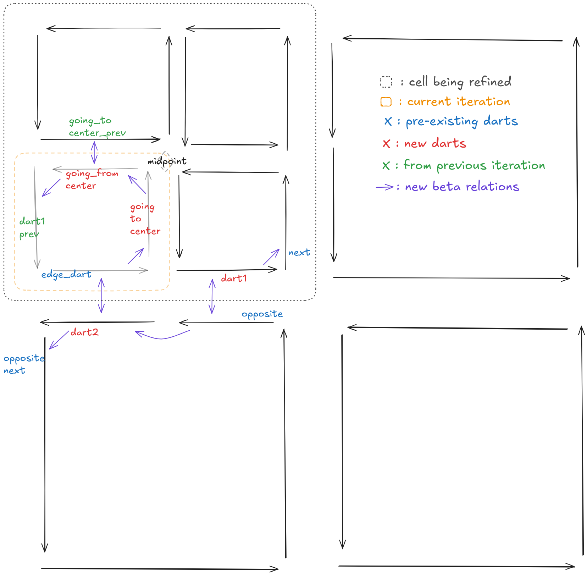

# overlaygrid-honeycomb

[honeycomb](https://github.com/LIHPC-Computational-Geometry/honeycomb) kernel that generate a quad/hex mesh from an input geometry using overlay-grid methods.

Currently only generates a 2d grid from input geometry.

### Cell division variable naming

### Known issues :
- Only weak balancing support (4-adjacency instead of 8 of balancing)
- Cells can be over-refined in 1 loop iteration if both marked for refining and balancing
- Distortions in some cells (could be explained by the above)
